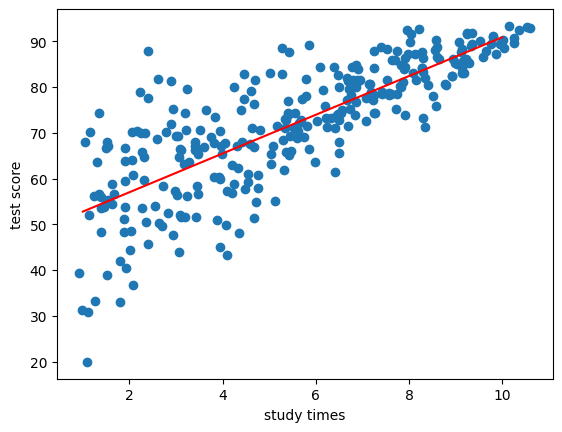

오늘 회귀분석 중 선형회귀 진행하겠습니다.

supervise learning 중에서 regression의 기본이 되는 linear regression이죠.

분야는 머신러닝이지만, 그리 거창한 내용은 아녜요. 통계학과 같은 부분에도 자주 나올 정도로 되게 수학적인 분석 방법 중 하나라고 이해하시면 될 거예요.

---

우리가 input으로 받은 x들이 우리가 구하고자 하는 y와 선형적인 관계를 갖는 것을 가정.

\*선형적인 관계는 x에 따라 y가 배수만큼 증가하는 것을 의미하죠.

x가 2배 커지면, y도 똑같이 2배 커지거나, x가 3배 커지면, y는 9배 커지거나 ... x의 증가율의 배수만큼 y도 증가한다는 것을 모든 variable에 대해서 가정하는 것이 선형 모델이에요.

물론 실생활의 대부분은 linear하지 않아요.

그럼에도 linear regression이 사용되는 이유는 속도 때문이에요. 이후에 자세히 보겠지만, 그저 연산이기에 2차원이라면 n만큼의 시간복잡도라고 할 수가 있어요.

즉, 굉장히 빠른 속도를 가진 모델이라서, 나중에 알아볼 정의에 따라서 선형 회귀로 풀면 안되는 것도 대충 맞는다 싶으면 선형으로 푸는 경우가 꽤나 있어요. 그리고, 이 땐 완벽하게 맞지는 않지만, 그럭저럭 맞는 결과를 보여줘요.

---

예시를 한 번 볼게요.

x축이 공부 시간, y축이 시험 점수입니다.

즉, 공부 시간에 따른 시험 점수이죠.

이런 데이터가 있을 때, 몇 가지 질문을 던질 수 있어요.

우선 첫번째, 공부 시간과 시험 점수가 관련이 있느냐

    - linear regression을 할 때는 우선 `관계가 존재한다`를 전제로 해요. 근데 만약 잘 안풀린다. 그렇다면 x에 따른 y의 관계가 존재하는지부터 확인해봐야 해요.

그리고 두번째, 공부 시간과 시험 점수가 어떠한 관계를 가지는가.

    - 공부 시간과 시험 점수와 정비례 하는지, 아니면 반비례 하는지부터 선형적인 관계가 있는지, 비선형적인 관계가 있는지 등이 있죠.

그리고 세번째, 공부 시간을 알고 있다면, 시험 점수를 어느정도로 예측할 수 있는가

뭐 이정도 질문이 있을 수 있겠죠.

---

선형 모델은 되게 단순하게 생겼어요. y = ax + b + e.

저희가 중학교 때 배웠던 1차함수와 똑같죠.

이 때 a는 계수, b는 y절편이라고 했었던 것도 기억이 날 거예요.

저희의 최종 목적은 y = ax + b라는 식을 완성시키는 거예요. 즉, a와 b를 찾는 거죠. 이 때의 a와 b를 `parameter`라고 불러요.

위의 이미지를 보면 알 수 있다시피 모든 값이 이 선 위에 있는 건 아니기 때문에 오차, 즉 엡실론이 1차함수 뒤에 붙어있는 것을 알 수 있어요.

만약 우리가 최적의 a와 b 값을 찾아내면 해당 함수를 y_hat = a_hat \* x + b_hat이라고 불러요.

그렇다면 처음 보는 x가 들어와도 y_hat, 즉, y의 예측값을 알 수 있게 되죠.

---

우선 a와 b를 구하기 위해서는 `에러`를 정의해야 함

이 때의 에러 e는 실제 y값과 예측한 y값의 차이를 사용.

RSS를 sigma(i=1 to n)(y_i값 - y_hat_i)^2라고 설정 가능.
